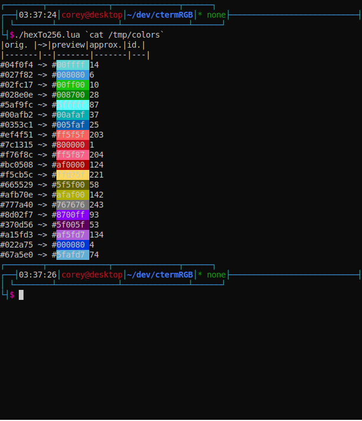
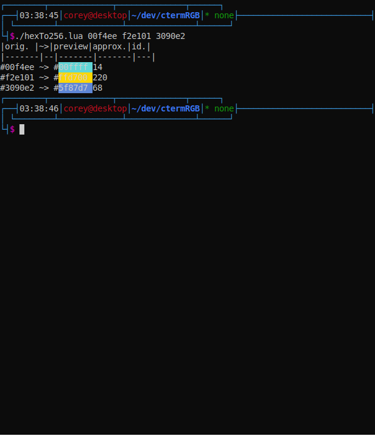

# HexTo256Color

A small utility script to convert round a full 8 bit RGB color to a 256-color compatible one.

# Usage
Just download the script and data file and run the script with the hex colors as arguments:

### Data
Color data gotten from https://jonasjacek.github.io/colors/
